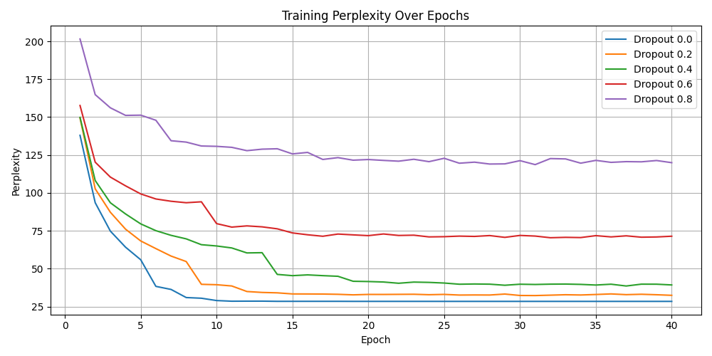
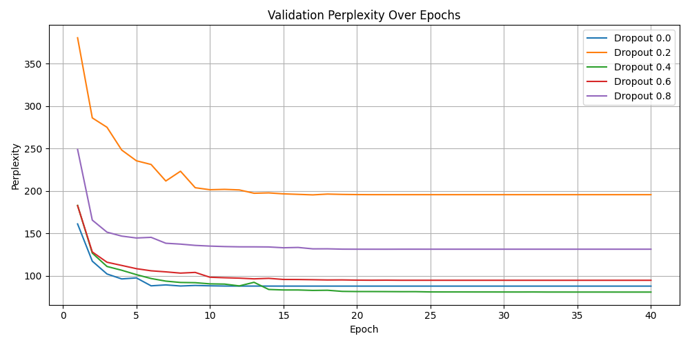

# MT Exercise 3: Pytorch RNN Language Models

This repo shows how to train neural language models using [Pytorch example code](https://github.com/pytorch/examples/tree/master/word_language_model). Thanks to Emma van den Bold, the original author of these scripts. 

# Requirements

- This only works on a Unix-like system, with bash.
- Python 3 must be installed on your system, i.e. the command `python3` must be available
- Make sure virtualenv is installed on your system. To install, e.g.

    `pip install virtualenv`

# Steps

Clone this repository in the desired place:

    git clone https://github.com/moritz-steiner/mt-exercise-03
    cd mt-exercise-03

Create a new virtualenv that uses Python 3. Please make sure to run this command outside of any virtual Python environment:

    ./scripts/make_virtualenv.sh

**Important**: Then activate the env by executing the `source` command that is output by the shell script above.

Download and install required software:

    ./scripts/install_packages.sh

Download and preprocess data:

    ./scripts/download_data.sh

Train a model:

    ./scripts/train.sh

The training process can be interrupted at any time, and the best checkpoint will always be saved.

Generate (sample) some text from a trained model with:

    ./scripts/generate.sh

-----

# Task 1

TODO

----
# Task 2

We worked on a macOS system, so eventually you need to make some changes if you run on a windows machine, for example change `python3`to `python`or disable mps. 

## Modifications of main.py for logging perplexity

Our modified main.py can be found in the folder `scripts` and is called `main_modified.py`. We added two additional arguments to the parser:

- `save-perplexities` the flag to determine if the perplexities should be stored in a log file
- `log-file` the path to store the log file

In the file you find a function called `log_perplexity()` which takes arguments as described in the code. This is called at the corresponding places in the script. All of the "Train", "Validation" and "Test" logs are stored in the same log file in the following structure: 

	1   Train  167.8992049241194  

## Model training

We trained 5 models with the following perplexities: 
- 0.0
- 0.2
- 0.4
- 0.6
- 0.8

For the other parameters we used the parameters as followed. These remained the same for all of the 5 models, only the dropout value changed. As log-interval we chose 10 to get close to the end of one epoch. 

	(  
	  cd $tools/pytorch-examples/word_language_model &&  
	    CUDA_VISIBLE_DEVICES=$device OMP_NUM_THREADS=$num_threads python3 main.py \  
	      --data $data/familyguy \  
	      --epochs 40 \  
	      --log-interval 10 \  
	      --emsize 200 --nhid 200 --dropout {dropout_value} --tied \  
	      --save $models/model.pt \  
	      --mps \  
	      --save-perplexities \  
	      --log-file $logs/perplexities_{dropout_value}.txt  
	)

## Clean and split log files

After training, we got 5 different log files in the folder called `logs`:
- `perplexities_0.0.txt`
- `perplexities_0.2.txt`
- `perplexities_0.4.txt`
- `perplexities_0.6.txt`
- `perplexities_0.8.txt`

Since our log-interval is 10 we get many logs for each epoch. Since only the log at the end of the epoch is relevant, we have to clean the log files to get only these specific numbers. Additionally to create the three tables for training, validation and test data, we have to split up the data. To do so, navigate to the `scripts` directory execute the following command in the terminal:

	python3 clean_log_folder.py --input_directory ../logs --output_directory ../logs_clean

This command takes the path to the directory of all of the log files (input) and the path where the cleaned log files should be stored (output).

The file extracts the last training log of each epoch and splits the data into training, validation and test files. In the end you have for each dropout value three files stored in `logs_clean/test`, `logs_clean/training` and `logs_clean/validation` such as:

- `perplexities_0.0_clean_test.txt`
- `perplexities_0.0_clean_train.txt`
- `perplexities_0.0_clean_valid.txt`

and this for every dropout value. 
## Create tables 

Since we now have the data split up to test, training and validation data, we can now create the tables. To do so, still in the `scripts` directory, execute the following command in the terminal:

	python3 create_log_table.py --test_dir ../logs_clean/test --valid_dir ../logs_clean/validation --train_dir ../logs_clean/training --output_dir ../logs_csv

You have to input the directories of the split up training, validation and test data and the output directory, where you want to store your tables.

For every directory the script creates a pandas dataframe as our table which we need for the visualization. We decided to store the dataframes as .csv files in the directory `logs_csv`. The script creates a dataframe for each training, validation and test data with the dropout values as headers and for each epoch the values. The tables look as follows:

	Validation Dataframe:
	       Dropout 0.0  Dropout 0.2  Dropout 0.4  Dropout 0.6  Dropout 0.8
	Epoch                                                                 
	1       161.108788   380.423364   182.937092   182.615540   248.844383
	2       117.240914   286.036730   126.706868   128.101396   165.601937
	3       102.137781   274.985956   110.983996   115.972402   151.404262
	4        96.319723   248.169602   106.529639   112.207522   146.764167
	[...]

	Training Dataframe:
       Dropout 0.0  Dropout 0.2  Dropout 0.4  Dropout 0.6  Dropout 0.8
	Epoch                                                                 
	1       137.991083   149.405749   149.821519   157.663685   201.523243
	2        93.579697   102.743097   108.196054   120.306297   164.836583
	3        74.828612    87.271733    93.523414   110.461468   156.139863
	4        64.239827    76.116960    86.162962   104.691018   151.153137
	[...]

	Test Dataframe:
       Dropout 0.0  Dropout 0.2  Dropout 0.4  Dropout 0.6  Dropout 0.8
	Epoch                                                                 
	40       80.835491   179.114961    74.338993    87.126646   121.397025

## Visualize the data

For the visualization still in the `scripts` directory execute the following command in the terminal:

	python3 plot_perplexity.py --validation_csv ../logs_csv/validation_dataframe.csv --training_csv ../logs_csv/training_dataframe.csv --output_dir ../plots

The script takes the training and validation .csv files (dataframes) and store the images of the plot in the specified output directory.

Our plots look as follows:

Final test perplexities:
- 0.0: 80.9
- 0.2: 179.1
- 0.4: 74.3
- 0.6: 87.1
- 0.8: 121.4

## Analysis of the results

Generally, both the training and validation perplexities should follow a similar trend such as decreasing while the model learns. If the training perplexity decreases and validation perplexity does not, it's a sign of overfitting. The test perplexity does a final check on the models performance and should align the validation trend. 

In our case, the final test perplexities align pretty well with the final test perplexities. The dropout of 0.4 has the lowest test perplexity and also the lowest validation perplexity which indicates that this is the best dropout setting to choose. It has not the lowest perplexity at training, but suggests that the dropout rate of 0.4 is better at generalization to the test data while e. g. the dropout rate of 0.0 is better at learning the training data (lower perplexity) but worse at generalization than the dropout rate of 0.4 (higher validation and final test perplexity). So we choose the dropout rate of 0.4.

**Sample text lowest perplexity**

	for a lot of city tiny <unk> and life ... like , now , I know you &apos;re going to  
	<unk> , blood , get tampon on his stupid Face . <eos> Except glad Mr <unk> up here I &apos;m  
	the only so <unk> . <eos> It just really hard than me , but I don &apos;t know what my  
	new days is then . <eos> I never sometimes or the options and even , like , Nobody helping each  
	other <unk> their own immediately that would you say you right . <eos> Coming up , as many smell is

**Sample data highest perplexity**

We got the worst perplexity with the dropout rate of 0.2:

	for a <unk> <unk> . light - a life inside today was a <unk> I <unk> finding a football .  
	<unk> , blood . <eos> tampon ? <eos> stupid in the other arm , Mr <unk> fake . ( multiracial  
	the students when <unk> . . face onto an drinks clean with a <unk> <unk> hours tribe . <eos> :  
	over . a reporter . the stuff ! sometimes or the options . even , I once . helping .  
	<eos> <unk> their <unk> ? <eos> Which . while the zoo way this sad is to , . smell it

We think the text with the lowest perplexity is better than the one with the highest perplexity. It has almost complete sentences and we think the text is a bit humorous ("stupid face") which resembles the training data. The text with the highest perplexity ist not very structured, has a lot of random punctuation in it and still has a lot of "unk" words in it. 